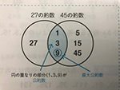
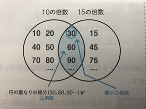

# Part 1
###
- 整数のたし算
- 整数の引き算
- 整数のかけ算
- 整数の割り算
- 計算の順番

---

### 整数の足し算
$$ 7 + 7 = 14 $$

### 整数の引き算
$$ 7 - 7 = 0 $$

### 整数のかけ算
$$ 7 * 7 = 49 $$

### 整数の割り算
$$ 7 / 7 = 1 $$

### 計算の順番
括弧の中を一番先に
[*, /]は[+,-]より先に
左から

---

# Part 2

- 小数とは
- 小数の足し算
- 小数の引き算
- 小数の掛け算
- 小数の割り算
- あまりの出る小数の割り算

---

### 小数とは

0.3, 0.51, 10.257などの数

それぞれの位の呼び方をおさらい

```例
1 . 2 3 4

1 : 一の位
. : 小数点
2 : 小数第一位 (1 / 10 の位)
3 : 小数第二位 (1 / 100 の位)
4 : 小数第三位 (1 / 1000 の位)
```

例題
(1) 5.84は、1を[ア]個、0.1を[イ]個、0.01を[ウ]個合わせた数です。

<div style="text-align: right;">
<u>A. [ア] 5 [イ] 8 [ウ] 4</u>
</div>

(2) 1.08は、0.01を[エ]個集めた数です。
<div style="text-align: right;">
<u>A. [エ] 108 </u>
</div>

---

### 小数の足し算

$$ 5.3 + 2.6 = 7.9 $$

### 小数の引き算

$$ 7.1 - 5.3 = 1.8 $$

### 小数の掛け算

$$ 9.3 \times 17 = 158.1 $$

```
   2.1 9
  ×  5.6
---------
   131 4
  1095
---------
  12.264
```

*右に揃えて計算し、結果にあとから小数点を付ける*

---

### 小数の割り算

$$ 3.768 \div 3.14 = 1.2 $$

```
      1.2
    ------
314)376.8
    314
    ------
     62 8
     62 8
     ----
        0
```

*割る数が整数となるまで10倍して小数点をずらして計算*

---

### あまりの出る小数の割り算

$$ 14.95 \div 5.2 = 2 \ldots 4.55 $$

```
      2
    ------
 52)14 9.5
    10 4
    ------
     4.55
```

*あまりの出る割り算は商をどこまで求めるか問題にかかれている*
*筆算では、小数点を動かすが、余りの小数点は動かす前の位置になるので注意*

---

# Part 3
###
- 約数とは
- 公約数と最大公約数
- 倍数とは
- 公倍数と最大公倍数
- 偶数と奇数

---

### 約数とは
ある整数を割り切ることのできる整数


### 約数の解き方
オリを使う解きかたで、書きもれを防ぐ
（例）36の約数
|1|2|3|4|6|
|:-:|:-:|:-:|:-:|:-|
|36|18|12|9||

---

### 公約数と最大公約数
- 公約数
2つ以上の整数に共通する約数

- 最大公約数
公約数のうち、最も大きい数

### 問題の解き方
ベン図を利用して公約数を探す
（例）27と45の公約数


---
### 倍数とは
ある整数の整数倍になっている数
＝ある整数で割り切れる数

（例）12の倍数
|12|24|36|48|60|72|...|
|:-:|:-:|:-:|:-:|:-:|:-:|:-|
|12×1|12×2|12×3|12×4|12×5|12×6|...|

---

### 公倍数と最小公倍数
- 公倍数
2つ以上の整数に共通する倍数

- 最小公倍数
公倍数のうち、最も小さい数

### 問題の解き方
ベン図を利用して公倍数を探す
（例）10と15の公倍数


---

### 偶数と奇数、素数
- 偶数
2で割り切れる整数＝2の倍数

- 奇数
2で割り切れない整数＝2の倍数+1

- 素数
1とその数自身しか約数がない数＝約数が２つだけの整数

（例）1,2,4,15,24,29,33
　偶数：2,4,24
　奇数：1,15,29,33
　素数：2,29

---

# Part 4

- 分数とは
$$ \frac{2}{5}$$
- 真分数
$$ \frac{1}{5}$$
- 仮分数
$$ \frac{5}{5} or \frac{5}{2}$$
- 帯分数
$$ 3\frac{2}{5}$$

---

### 仮分数、帯分数 → 整数
```
5 / 3 = 1 ... 2
```
$$ \frac{5}{3} = 1\frac{2}{3}$$

### 帯分数 → 仮分数

$$ 2\frac{2}{3} = \frac{2 * 3 +2}{3} =\frac{8}{3}$$

---

### 約分
最大公約数で割る
$$ \frac{24}{32} = \frac{24 / 8}{32 / 8} =\frac{3}{4}$$

### 通分
最小公倍数にそろえる
$$ \frac{5}{7},\frac{3}{4} = \frac{5 * 4}{7 * 4},\frac{3 * 7}{4 * 7} =\frac{20}{28},\frac{21}{28} $$

---

### 分数と少数の変換
$$ 2\frac{7}{20} = 2+ \frac{7}{20}= 2+(7/20) = 2+(0.35)=2.35$$

### 帯分数のくり上げ
$$ 3\frac{16}{13}= 3 +\frac{16}{13}=3 +1\frac{3}{13}=4\frac{3}{13}$$

### 帯分数のくり下げ
$$ 3\frac{1}{13}= 2 +1\frac{1}{13}=2 +\frac{14}{13}=2\frac{14}{13}$$

---

### 分数のたし算
$$ \frac{3}{5}+\frac{3}{5}=  \frac{6}{5}=1\frac{1}{5}$$
$$ \frac{3}{5}+\frac{3}{2}=  \frac{6}{10}+\frac{15}{10}=\frac{21}{10}=2\frac{1}{10}$$

### 分数の引き算
$$ 3\frac{2}{5}-\frac{3}{5}= 2\frac{7}{5}-\frac{3}{5}=  2\frac{4}{5}$$
$$ \frac{3}{2}-\frac{3}{5}=  \frac{15}{10}-\frac{6}{10}=\frac{9}{10}$$

---

### 分数のかけ算
$$ \frac{3}{2}*\frac{3}{5}=  \frac{3 * 3}{2 * 5}=\frac{9}{10}$$

### 分数の割り算
$$ \frac{3}{2}/\frac{3}{5}=   \frac{3}{2}*\frac{5}{3}=\frac{3 * 5}{2 * 3}=\frac{15}{6}=\frac{5}{2}$$

---

# Part 5

* さまざまな四角形
* さまざまな三角形
* N角形
* 円、おうぎ形

---

さまざまな四角形

### 四角形とは

4本の直線、4つの頂点があり、内角の和が360度となる

### 四角形の種類

* 正方形
* 長方形
* 平行四辺形
* 台形
* ひし形

---

### 四角形の面積

##### 面積を求める公式

* 基本的には、タテ × ヨコ
	* 正方形: 1辺 × 1辺
	* 長方形: たて × 横
	* 平行四辺形: 底辺 × 高さ

* 台形は、(上底 + 下底) × 高さ ÷ 2
	* 面積2倍の平行四辺形を計算し、2で割る

* ひし形は、対角線 × 対角線 ÷ 2
	* 4つの三角形の面積を計算しているイメージ

---

さまざまな三角形

### 三角形とは

3本の直線、3つの頂点があり、内角の和が180度となる

### 三角形の種類

* 正三角形
* 二等辺三角形
* 直角三角形
* 直角二等辺三角形

### 三角形の面積

* 基本的に、底辺 × 高さ ÷ 2
*底辺と高さは垂直(90度)に交わる*

---

多角形とは

### N角形とは

N本の直線、N個の頂点があり、内角の和は *180 × (N - 2)* となる

* 四角形は2個の三角形
* 五角形は3個の三角形

### 練習問題

(1) 八角形の内角の和は
$$ 180 \times (8 - 2) = 1080 $$

(2) 正八角形の1つの内角の大きさは

$$ 1080 \div 8 = 135 $$

---

### 円

* 円周の長さ: 直径 × π = (半径 × 2) × π
* 面積: 半径 × 半径 × π


### おうぎ形

* 弧の長さ: 円周の長さ × (中心角 / 360)
* 面積: 円の面積 × (中心角 / 360)

### 練習問題

* 半径5cm 中心角が72度のおうぎ形の長さと面積を求める

おうぎ形の長さ

$$ 5 \times 2 \times 3.14 \times \frac {72} {360} = 6.28 $$

おうぎ形の面積

$$ 5 \times 5 \times 3.14 \times \frac {72} {360} = 15.7 $$

---

### 線対称

*対称の軸* で折り曲げてピッタリ重なる形
折り曲げた時の対応する辺、点の長さや角度は等しくなる

### 点対称

*対称の中心* で180度回転させると、回転前の形とぴったり重なる形
180度回転させた時の対応する辺、点の長さや角度は等しくなる

---

拡大図と縮図

### 拡大図

ある図形を同じ形のまま大きくしたもの
辺の長さが2倍なら2倍の拡大図という

### 縮図

ある図形を同じ形のまま小さくしたもの
辺の長さが1/2倍なら1/2の縮図という

---

# Part 7

- 平均 = 合計 / 個数
- 個数 = 合計 / 平均
- 合計 = 平均 * 個数

---

### 単位量あたりの大きさ
- $1m^2$あたり２人
- 1Lあたり15ｋｍ
- 1mあたり30g

---
### 人口密度 = 人口 / 面積

|  | 面積 ($m^2$) | 人数 (人) |
| --- | --- | --- |
| 南公園 | 170 | 20|
| 北公園 | 130 | 10|

20 / 170 = 0.11764...人($1m^2$あたり)
10 / 130 = 0.0769....人($1m^2$あたり)

### 様々な単位
| 1/1000 | 1 | 1 * 1000 |
| --- | --- | --- |
| 1mm | 1m | 1km |
| 1mg | 1g | 1kg|
| 1mL | 1L | 1kL|

---
### $cm^2$ と $m^2$の関係
- $1m^2$が何$cm^2$か
$1m^2$ = 1m * 1m = 100cm * 100cm = 10,000$cm^2$

### $cm^3$ と $m^3$の関係
- $1m^3$が何$cm^3$か
$1m^3$ = 1m * 1m * 1m = 100cm * 100cm * 100cm = $1,000,000cm^3$

---


|   | 1倍 | 10倍 | 100倍 | 1000倍 |
| --- | --- | --- | --- | --- |
| 長さ | $1mm$ | $1cm$ | $1m$ | $1km$ |
| 重さ| $1mg$ | $1g$ | 1kg$ | $1t$ |

| | 1倍 | 10倍 | 100倍 | 100倍 | 1000倍 |
| --- | --- | --- | --- | --- | --- |
| 面積 | $1cm^2$ | $1m^2$ | $1a$ | $1ha$ | $1km^2$ |

| | 1倍 | 100倍 | 10倍 | 1000倍 |
| --- | --- | --- | --- | --- |
|体積、容積 | $1cm^3$ = $1mL$ | $1dL$ | $1L$ | $1m^3$ = $1kL$ |

---

### 単位の換算
- 2.15kg = ?g
1kg = 1000g 
2.15 * 1000 = 2150g
- 35cm = ?m
1m = 100cm 
35 / 100 = 0.35m

---

# Part 8

### 速さ

###### 速さの種類

* 時速
* 分速 (時速 ÷ 60)
* 秒速 (分速 ÷ 60)


###### 例題

時速48km = 分速？？m

$$ 48km/h = 48000m/h = 48000 ÷ 60m/m = 800m/m $$

*速さの単位と距離の単位変換に注意*

---

### 変換の裏技

秒速？m <--> 時速？kmを変換する裏技は
3.6をかけたり、割ったりする。


$$ 20m/s \times 3.6 = 72km/h $$

$$ 72km/h \div 3.6 = 20m/s $$

---

### 練習問題

(1) 秒速25mは、分速何mか、また時速何kmか
$$ 25m/s = 25 \times 60m/m = 1500m/m $$
$$ 25m/s = 25 \times 3.6 = 90km/h $$

(2) 時速54kmは、分速何mか、また秒速何mか
$$ 54km/h = 54000m/h = 54000 \div 60m/h = 900m/m $$
$$ 54km/h = 54 \div 3.6 = 15m/s $$

---

### 速さの3公式

1. 速さ = 道のり ÷ 時間
1. 道のり = 速さ × 時間
1. 時間 = 道のり ÷ 速さ

###### 覚え方
「み(m)・は(h)・じ(j)」で覚える


$$\frac {m} {h \times j}$$

---

### 練習問題

Aさんが、4kmの道のりを50分で歩きます

(1) Aさんの歩く速さは分速何mですか
道のり ÷ 時間

$$ \frac {4} {50}km/m = \frac {4000} {50}m/m = 80m/m $$

(2) Aさんが2時間歩くと、何km進みますか
速さ × 時間

$$ 80m/m \times 2 \times 60 = 9600m = 9.6km $$


(3) Aさんが5.6km歩くのに、何時間何分かかりますか。
道のり ÷ 速さ

$$ 5.6km \div 80m/m = 5600m \div 80m = 70m = 1h10m $$

---

### 旅人算


---

# Part 10
### 比とは
$$ 3 : 4 = 3 \div 4 = \frac {3}{4} $$

### 練習問題

$$ \frac {3}{4} : \frac {9}{11} $$
$$ \frac {3}{4} \div \frac {9}{11} = \frac {3}{4} \times \frac {11}{9} = \frac {11}{12} $$

---
### 比をかんたんにする
$$ 3:2 = 15:10 $$
$$ 8:12 = 2:3 $$

### 練習問題

$$ 45:60 $$
$$ 45 \div 15:60\div 15 = 3:4 $$

---

### 比例式
$$ A:B = C:D $$
$$ A \cdot C = B \cdot D$$

### 練習問題
次のxに当てはまる数を答えましょう。
$$ 2:5 = x:7 $$
$$ 5x = 14$$
$$ x = 14 \div 5$$
$$ x = 2.8 $$

---

### 比の文章題
兄と弟の持っているお金の比は6:5です。兄が540円持っている時、弟は何円もっていますか。

$$ 6:5 = 540:x $$
$$ 6x = 5 \times 540 $$
$$ x = 5 \times 540 \div 6 $$
$$ x = 450 $$

### 練習問題
鉛筆とボールペンが合わせて60本、鉛筆とボールペンの本数の比が5:7の時、ボールペンは何本ですか。

$$ 60 / (5+7) = 5 $$
$$ 7 \times 5 = 35 $$


---

# Part 11

### 比例

###### 比例とは

ある数が、別の要素の増加にともなって増加する
xとyがあって、xが2倍、3倍になると、yも2倍、3倍になるとき「yはxに比例する」

$$ y = a \times x $$

---

### 練習問題

長さx(cm)|1|2|3|4|5|6
---|-|-|-|---|---|-
重さy(g)|12|24|36|48|60|72

(1) yはxに比例しているか。 → 比例している
(2) xとyの関係を式に表す
$$ y = 12x$$ 
(3) xの値が9.5の時のyの値
$$ y = 12 \times 9.5 = 114 $$
(4) yの値が138の時、xの値
$$138 = 12x$$
$$x=138 \div 12 = 11.5$$


---

### 比例のグラフ

##### グラフを書く

###### xとyを表に書く
x|0|1|2|3|4|5
-|-|-|-|-|-|-
y|0|2|4|6|8|10

###### あとはグラフを書く(準備中)


---

### 練習問題

直方体の形をした空の水槽に、1分あたり5cmずつ深くなるよう水を入れていきます。
水を入れる時間をx分、水の深さをycmとするとき、次のといに答えよ

(1) xとyの関係を式に表しましょう
$$ y = 5x $$

(2) xとyの関係を表に書きましょう
時間 x(分)|0|1|2|3|4|5
-|-|-|-|-|-|-
深さ y(cm)|0|5|10|15|20|25

(3)(2)をグラフで書きましょう
(準備中)

---

### 反比例

###### 反比例とは

比例の逆で、xが2倍、3倍となると、yが1/2、1/3となる値

###### 反比例の表

たて x(cm)|1|2|3|6
-|-|-|-|-
横 y(cm)|6|3|2|1

$$ y = \frac {6}{x} $$

---

### 練習問題

下の表は、面積が  $18cm^2$ の平行四辺形の底辺の長さxcmと高さycmの関係です

底辺 x(cm)|1|2|3|6|9|18
-|-|-|-|-|-|-
高さ y(cm)|18|9|6|3|2|1

(1) yはxに反比例しているか → 反比例している
(2) 関係を式で表す
$$ y = \frac {18} {x} $$
(3) xの値が4.5の時、yの値は
$$ y = \frac {18} {4.5} = 4 $$

---

### 反比例のグラフ

(準備中)


