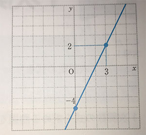
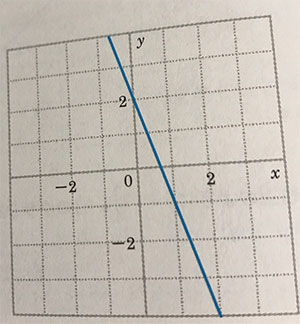
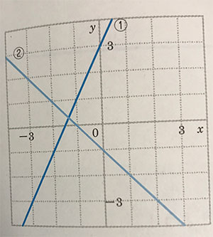

# Part 1
###
- 正の数と負の数
```
正の数：0より大きい数
負の数：0より小さい数

+5(0より5大きい) → 正の数
-5(0より5小さい) → 負の数

整数：正の整数(=自然数)、0、負の整数
```
---

- 数の大小
```
不等号：>、<
+4 > -3
-3 < +4
```

- 絶対値とは
```
+5 の絶たちは -5
-5 の絶たちは +5
正負の数から、符号(+,-)をとりのぞいた数
```
---

- 同じ符号のたし算
$$ (+8) + (+7) = $$
$$ (+8) + (+7) = +(8+7) = +15$$

- 同じ符号の引き算
$$ (-8) + (-7) = $$
$$ (-8) + (-7) = -(8+7) = -15$$
---

- 違う符号のたし算
$$ (+8) + (-7) = $$
$$ (+8) + (-7) = +(8-7) = +1$$

- 違う符号の引き算
$$ (-8) + (+7) = $$
$$ (-8) + (+7) = -(8-7) = -1$$
---

- 正負の引き算
$$ (+8) - (+7) = $$
$$ (+8) - (+7) = +(8-7) = +1$$
---

- 掛け算と割り算
```
同じ符号の掛け・割り算 : +
ex) 正*正、負*負

違う符号の掛け・割り算 : -
ex) 正*負、負*正
```
#### 掛け算
$$ (+4) \times (+7) = +(4\times7) = +28 = 28$$

$$ (+4) \times (-7) = -(4\times7) = -28 = -28$$
#### 割り算
$$ (+7) \div (+7) = +(7\div7) = +1 = 1$$

$$ (+7) \div (-7) = -(7\div) = -1 = -1$$
---
#### 掛け算と割り算だけの式
```
負の数が偶数個 : +
負の数が奇数個 : -
```
$$ -2 \times 6 \times (-5) = +(2\times6\times5) = 60$$

$$ -5 \times 0 \div \frac {2}{3} \times (-8.1) = 0$$

---
#### 累乗とは
```
同じ数をいくつか掛けたもの
```
$$ -3^{2} = -(3\times 3) = -9 $$
$$ (-3)^{2}  = (-3\times -3) = 9 $$
$$ -(-3)^{2}  = -(-3\times -3) = -9 $$
$$ \frac {2}{3}^{2}  = \frac {2 \times 2}{3} = \frac {4}{3} $$
$$ (\frac {2}{3})^{2}  = \frac {2}{3} \times \frac {2}{3} = \frac {4}{9} $$
---
#### 四則のまじった計算
```
累乗、かっこの中 → 掛け・割り算 → 足し・引き算
```
$$ -4 + 4 \times (-3) = $$
$$ -4 + 4 \times (-3) = -4 + (-12) = -16$$
 
---
# Part 3　　1次方程式
###
- 方程式とは
- 移項を使った方程式の解き方
- 1次方程式の文章題
---

### 方程式とは
- 方程式で出てくる用語
```
等号：「＝」のこと
等式：等号を使って数や量の等しい関係を表した式

左辺：「＝」より左側にある式
右辺：「＝」より右側にある式
両辺：左辺と右辺を合わせた式全体

2x + 4 = 10
  左辺　　右辺

方程式：文字に代入する値によって、成立するかどうかが変わる等式
解：方程式を成立させる値

2x + 4 = 10 ←方程式
x = 3 ←解

```
---
- 等式の性質
A=Bならば、以下の等式が成り立つ。

$$ A + C = B + C $$
$$ A - C = B - C $$
$$ AC = BC $$ 
$$ \frac {A}{C} = \frac {B}{C}$$
$$ B=A $$

---
### 移項を使った方程式の解き方
```
移項：等式の項において、その符号を入れ替えて、
　　　左辺から右辺へまたは右辺から左辺へ移動させること。
```
$$ x + 8 = 15 $$
+8を右辺に移項して-8とする
$$ x = 15 - 8 $$
$$ x = 7 $$
---
### 1次方程式の文章題

1.求めたいものをxとする
2.方程式を作る
3.方程式を解く

```
ボールペン5本と120円の消しゴムを6つ買ったところ、
代金の合計は1520円になりました。
ボールペン１本の値段は何円ですか。
```

---
求めたいもの：ボールペン１本の値段 = x円
方程式：
x円のボールペン5本の代金 + 120円の消しゴム6つの代金 = 代金の合計
$$ 5x + 720 = 1520 $$

方程式を解く
$$ 5x + 720 = 1520 $$
$$ 5x = 1520 - 720 $$
$$ 5x = 800$$
$$ x = 160$$
A.160円

---
```
何人かの子どもたちにボールペンを配ります。
1人に7本ずつ配ると12本たりません。
また、1人に5本ずつ配ると6本余ります。
このとき、子どもたちの人数と、ボールペンの本数を求めましょう。
```
xとするもの：子どもたちの人数
方程式：
1人に7本ずつ配ると12本たりないボールペンの数
= 1人に5本ずつ配ると6本余るボールペンの数

$$ 7x - 12 = 5x + 6 $$

---
方程式を解く
$$ 7x - 12 = 5x + 6 $$
$$ 7x - 5x = 6 + 12 $$
$$ 2x = 18 $$
$$ x = 9 $$

A.子どもの人数：9人　ボールペンの本数：51本

---

# Part 4
###
- 座標とは


---
```
店の位置を座標で表せる表面を座標表面という
```
$$ A (4,3)$$
$$ A (-2,-3)$$

---
- 比例とグラフ
$$ y = ax $$
```
yはxに比例する
a : 比例定数

※比例のグラフは、原点を通る直線になる
```
---
- 比例とグラフ


---
- 反比例とグラフ
$$ y = \frac {a}{x} $$
```
yはxに反比例する
a : 比例定数

※反比例のグラフは、なめらかな２つの曲線になり、これを双曲線という
```


---
- 反比例とグラフ


---
# Part 6
###
1次関数
- 1次関数とグラフ
- 1次関数の式の求め方
- 交点の座標の求め方

---
### 1次関数とグラフ

- 1次関数とは

$$ y = ax + b $$
```
a:傾き
b:切片
```
$$ y = -2x - 3 $$
傾き：-2
切片：-3

---
- 1次関数のグラフのかきかた

```
1. y = ax + b のグラフは(0,b)を通る
2. xに適当な整数を代入して、直線が通るもう１つの点を見つける
3. 2つの点を直線で結ぶ
```
$$ y = 2x - 4 $$



---
### 1次関数の式の求め方


1次関数の式を
$$ y = ax + b $$
とおいて解く。

---
```
グラフの傾きが-3で、点（1,-5）を通る1次関数の式を求めましょう。
```
傾きが-3なので、
$$ y = -3x + b $$

点（1,-5）を通るので、上記の式にx=1,y=-5を代入する。
$$ -5 = -3 * 1 + b $$
$$ b = -2 $$
よってこの1次関数の式は
$$ y = -3x -2 $$

---
```
図の直線の式を求めましょう。
```


y軸との交点が(0,2)なので、
$$ b = 2 $$
$$ y = ax +2 $$

---

グラフが点（1,-1）を通っているので、x=1,y=-1を代入する
$$ -1 = a +2 $$
$$ a = -3 $$

よってこの1次関数の式は
$$ y = -3x +2 $$

---
```
yはxの1次関数で、そのグラフは2点(-1,-5)、(2,7)を通ります。
このとき、この1次関数の式を求めましょう。
```
$$ y = ax + b $$
に、それぞれの座標を代入する。

$$ -5 = -a + b $$
$$ 7 = 2a + b $$

この連立方程式を解くと、
$$ a = 4, b = -1 $$

よってこの1次関数の式は
$$ y = 4x -1 $$

---

### 交点の座標の求め方

```
2直線の交点の座標は、連立方程式を解いて求める。
```

---

```
2直線があり、それぞれの直線の式は、
y = -x + 2 と y = 2x - 3 です。
この2直線の交点の座標を求めましょう。
```
$$ y = -x + 2 $$
$$ y = 2x - 3 $$
この連立方程式を解くと、

$$ -x + 2 = 2x - 3 $$
$$ -3x = - 5 $$
$$ x = \frac {5}{3} $$

---

$$ y = -\frac {5}{3} + 2 $$
$$ y = \frac {1}{3} $$

よって交点の座標は
$$ ( \frac {5}{3}, \frac {1}{3}) $$

---

```
図の直線①と直線②の交点の座標を求めましょう。
```


まずは2直線の式をそれぞれ求める。
①は点(0,3)、(-2,-1)を通るので、
$$ -1 = -2a + 3 $$
$$ a = 2 $$
$$ y = 2x + 3 $$

---
②は点(0,-1)、(1,-2)を通るので、
$$ -2 = a - 1 $$
$$ a = -1 $$
$$ y = -x - 1 $$

①、②の式の連立方程式を解く。
$$ y = 2x + 3 $$
$$ y = -x - 1 $$
$$ 2x + 3 = -x - 1 $$

---
$$ 3x = - 4 $$
$$ x = -\frac {4}{3} $$
$$ y = -(-\frac {4}{3}) - 1 $$
$$ y = \frac {1}{3} $$

よって交点の座標は
$$ ( -\frac {4}{3}, \frac {1}{3}) $$

---
# Part 9
###
2次方程式
- 2次方程式を平方根の考え方で解く
- 2次方程式を因数分解で解く
- 2次方程式を解の公式で解く
- 2次方程式の文章題

---
### 2次方程式を平方根の考え方で解く
```
2次方程式：移項して整理すると 2次式 = 0 の形になる方程式
```

$$ x$$
