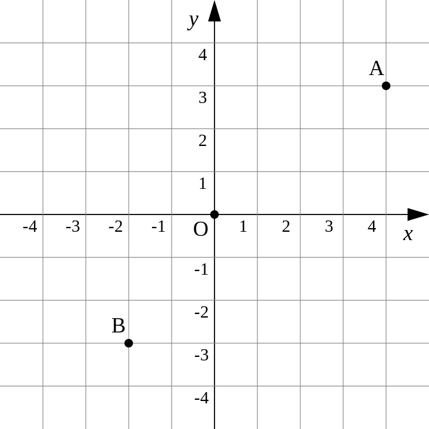
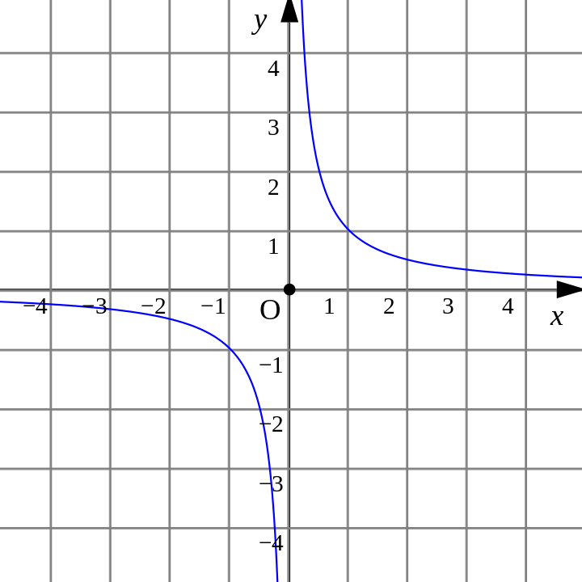
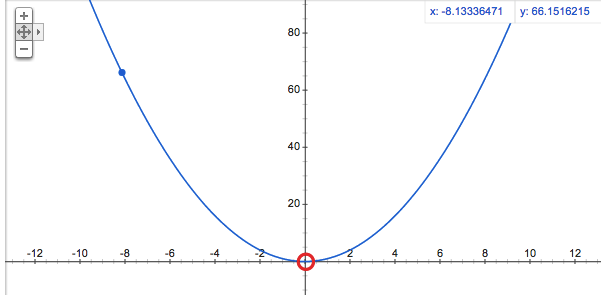

<!-- $theme: default -->

# Part 1
###
- 正の数と負の数
```
正の数：0より大きい数
負の数：0より小さい数

+5(0より5大きい) → 正の数
-5(0より5小さい) → 負の数

整数：正の整数(=自然数)、0、負の整数
```
---

- 数の大小
```
不等号：>、<
+4 > -3
-3 < +4
```

- 絶対値とは
```
+5 の絶たちは -5
-5 の絶たちは +5
正負の数から、符号(+,-)をとりのぞいた数
```
---

- 同じ符号のたし算
$$ (+8) + (+7) = $$
$$ (+8) + (+7) = +(8+7) = +15$$

- 同じ符号の引き算
$$ (-8) + (-7) = $$
$$ (-8) + (-7) = -(8+7) = -15$$
---

- 違う符号のたし算
$$ (+8) + (-7) = $$
$$ (+8) + (-7) = +(8-7) = +1$$

- 違う符号の引き算
$$ (-8) + (+7) = $$
$$ (-8) + (+7) = -(8-7) = -1$$
---

- 正負の引き算
$$ (+8) - (+7) = $$
$$ (+8) - (+7) = +(8-7) = +1$$
---

- 掛け算と割り算
```
同じ符号の掛け・割り算 : +
ex) 正*正、負*負

違う符号の掛け・割り算 : -
ex) 正*負、負*正
```
#### 掛け算
$$ (+4) \times (+7) = +(4\times7) = +28 = 28$$

$$ (+4) \times (-7) = -(4\times7) = -28 = -28$$
#### 割り算
$$ (+7) \div (+7) = +(7\div7) = +1 = 1$$

$$ (+7) \div (-7) = -(7\div) = -1 = -1$$
---
#### 掛け算と割り算だけの式
```
負の数が偶数個 : +
負の数が奇数個 : -
```
$$ -2 \times 6 \times (-5) = +(2\times6\times5) = 60$$

$$ -5 \times 0 \div \frac {2}{3} \times (-8.1) = 0$$

---
#### 累乗とは
```
同じ数をいくつか掛けたもの
```
$$ -3^{2} = -(3\times 3) = -9 $$
$$ (-3)^{2}  = (-3\times -3) = 9 $$
$$ -(-3)^{2}  = -(-3\times -3) = -9 $$
$$ \frac {2}{3}^{2}  = \frac {2 \times 2}{3} = \frac {4}{3} $$
$$ (\frac {2}{3})^{2}  = \frac {2}{3} \times \frac {2}{3} = \frac {4}{9} $$
---
#### 四則のまじった計算
```
累乗、かっこの中 → 掛け・割り算 → 足し・引き算
```
$$ -4 + 4 \times (-3) = $$
$$ -4 + 4 \times (-3) = -4 + (-12) = -16$$
 
---
# Part 4
###
- 座標とは


---
```
点の位置を座標で表せる表面を座標表面という
```
$$ A (4,3)$$
$$ A (-2,-3)$$

---
- 比例とグラフ
$$ y = ax $$
```
yはxに比例する
a : 比例定数

※比例のグラフは、原点を通る直線になる
```
---
- 比例とグラフ


---
- 反比例とグラフ
$$ y = \frac {a}{x} $$
```
yはxに反比例する
a : 比例定数

※反比例のグラフは、なめらかな２つの曲線になり、これを双曲線という
```


---
- 反比例とグラフ


---

# Part 7
平方根(へいほうこん)とは
```
正の数には、平方根が2つあること
```
2乗するとaになる数を、aの平方根という
例えば、
$$ 5^{2} = (-5)^{2} = 25 $$
だから、25の平方根は、5と-5です。
このように、正の数には方今が2つあり、絶対値が等しく、符号が異なる
問題1.
$$ 64 $$
$$ 8^{2} = (-8)^{2} = 8,-8 $$

---

### √(根号 = ルート)の使い方

$$ \sqrt a $$
```
読み方：ルートa
```
$$ \sqrt -a $$
```
読み方：マイナスルートa
```
$$ \pm \sqrt a $$
```
読み方：プラスマイナスルートa
```

---

###### 問題.
```
次の数の平方根を答えましょう
4
```
4の平方根は2と-2(または ±2)

### 公式.
$$(\sqrt a)^{2}  = (-\sqrt a)^{2} = a$$

###### 問題.
```
次の数の方根を使わずに答えましょう
```
$$ -(\sqrt 21)^{2} $$
$$ -(21) = -21$$

---
#### 平方根を少数に直すと・・・？
$$ \sqrt 2^{2} = 1.41421356... $$
$$ \sqrt 3^{2} = 1.7320508... $$
$$ \sqrt 4^{2} = 1.2360679... $$

---
#### 平方根のかけ算と割り算
```
平方根の掛け算と割り算の公式をおさえよう。
```
$$ \sqrt a \times \sqrt b = \sqrt {ab}  $$
$$ \sqrt 3 \times \sqrt 5 = \sqrt {3 \times 5} = \sqrt {15}  $$
$$ a \times \sqrt 5 = a\sqrt {5}  $$
$$ \sqrt a \div \sqrt b = \frac {\sqrt {a}}{\sqrt {b}} = \sqrt \frac{a}{b}  $$
$$ \sqrt 55 \div \sqrt 5 = \frac {\sqrt {55}}{\sqrt {5}} = \sqrt {11}  $$
---

#### 平方根のかけ算と割り算
$$ a \sqrt b = a \times \sqrt b = \sqrt {a^{2}} \times \sqrt b = \sqrt {a^{2}b}$$
$$ 3 \sqrt 5 = 3 \times \sqrt 5 = \sqrt {3^{2}} \times \sqrt 5 = \sqrt {9 \times 5} = \sqrt {45}$$


---
#### 素数とは
```
1とその数自身しか約数がない数を素数
=約数が2つだけの数が素数
1は、約数が1つしかないので、素数ではない。
2、3、5、7、11、13、17...
```

#### 素因数分解とは
```
自然数を素数だけの積に表すこと
15 = 3 x 5のように、そうすだけの積に表すことができる。これが素因数分解
```

---


###### 問題
```
90を素因数分解
```
$$ 90 \div 2 = 45 $$
$$ 45 \div 3 = 15 $$
$$ 15 \div 3 = 5 $$
$$ 90 = 2 \times 3 \times 3 \times 5 $$
$$ 90 = 2 \times 3^{2} \times 5 $$

---
$$ a \sqrt b = \sqrt {a^{2}b} $$
```
√ないの２乗の数は、２乗を外して√の外に出そう
```

###### 問題

$$ \sqrt {12} $$
$$ \sqrt {12} = \sqrt {2^{2} \times 3} = 2\sqrt {3}$$

$$ \sqrt {28} \times \sqrt {18} $$
$$ \sqrt {28} \times \sqrt {18} = 2\sqrt {7} \times 3\sqrt {2} = 2 \times 3 \times \sqrt {7} \times \sqrt {2} = 6\sqrt {14}$$

---
#### 分母の有理化
```
分母を√がない形に変形することを、分母の有理化という
```

$$ \frac {\sqrt {3}}{\sqrt {5}} = \frac {\sqrt {3} \times \sqrt5  }{\sqrt {5} \times \sqrt5  } = = \frac {\sqrt {15}}{(\sqrt 5)^{2}} \frac {\sqrt {15}}{5}  $$

#### 無理数
```
分母と分子が整数の分数で表せない数を無理数という
√2、√3、πなど
```
---

#### 平方根の足し算と引き算
###### 問題
$$ 2\sqrt 7 + 3\sqrt 7 $$
$$ 2\sqrt 7 + 3\sqrt 7 = 5 \sqrt 7 $$

$$ \sqrt {27} - \frac {6}{\sqrt 3} $$
$$ \sqrt {27} - \frac {6}{\sqrt 3} = \sqrt {3^{2} \times 3} - \frac {6}{\sqrt 3} = 3\sqrt {3} - \frac {6 \times \sqrt 3}{\sqrt 3 \times \sqrt 3} = \sqrt 3 $$


---

# Part 10

$$ y = ax^{2} $$




```
・yはx2に比例している
・それぞれの点を直線で結ぶのではなく、なめらかな曲線で結ぶ
・このようなフラフを放物線(ほうぶつせん)という
・必ず原点を通る
```

---

#### 変化の割合とは
```
・変化の割合とは yの増加量/xの増加量
・xが増える量にたいしてyがどれだけ増えたかを示す割合
・例えば, 
xが2から5まで増えたら、xの増加量は5−2=3, 
yが1から7まで増えたら、yの増加量は7−1=6、
変化の割合 = yの増加量/xの増加量 = 6 / 3 = 2となる
```

#### 1次関数の変化の割合

###### 例題 
1次関数 y= 3x + 1で、xの値が2から6まで変化するとき、次の問いに答えましょう。
(1) xの増加量とyの増加量をそれぞれ答える
xの増加量 = 6-2 = `4`
y = 3 * 2 + 1 = 7 , y = 3 * 6 + 1 = 19
yの増加量 = 19 - 7 = `12`

(2) このときの変化の割合を求める
12/4 = `3`

---


#### y=ax^2の変化の割合

###### 例題 
関数 y = -3x^2で、xの値が1から4まで変化するとき、次の問いに答える。
(1) xの増加量とyの増加量をそれぞれ答える
xの増加量 = 4-1 = `3`
y = -3 * 16 = -48 , y = -3 * 1 = -3
yの増加量 = -48 - (-3) = `-45`

(2) このときの変化の割合を求める
-45/3 = `-15`

---

##### point
###### 1次関数とy=ax^2の変化の割合の違い
```
・1次関数 y = ax + b の変化の場合は、傾きaに必ず等しくなる
例問1(2)のy=3x + 1 は計算しなくても3と求めることが可能
・y=ax^2では、
xの値が何から何に変化するかによって、変化の割合が変わるので、
その都度、変化の割合を計算して求める必要がある
```

