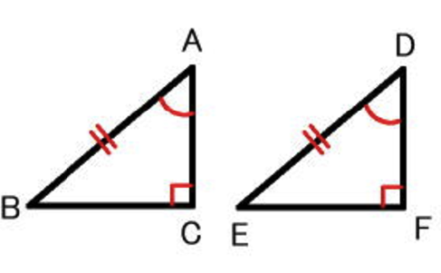
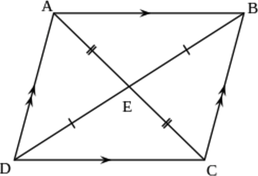
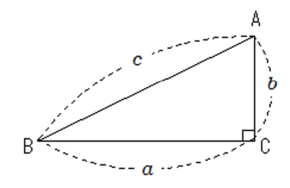
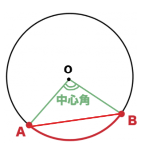
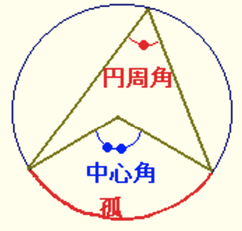

<!-- $theme: default -->

# Part 1
###
- 正の数と負の数
```
正の数：0より大きい数
負の数：0より小さい数

+5(0より5大きい) → 正の数
-5(0より5小さい) → 負の数

整数：正の整数(=自然数)、0、負の整数
```
---

- 数の大小
```
不等号：>、<
+4 > -3
-3 < +4
```

- 絶対値とは
```
+5 の絶たちは -5
-5 の絶たちは +5
正負の数から、符号(+,-)をとりのぞいた数
```
---

- 同じ符号のたし算
$$ (+8) + (+7) = $$
$$ (+8) + (+7) = +(8+7) = +15$$

- 同じ符号の引き算
$$ (-8) + (-7) = $$
$$ (-8) + (-7) = -(8+7) = -15$$
---

- 違う符号のたし算
$$ (+8) + (-7) = $$
$$ (+8) + (-7) = +(8-7) = +1$$

- 違う符号の引き算
$$ (-8) + (+7) = $$
$$ (-8) + (+7) = -(8-7) = -1$$
---

- 正負の引き算
$$ (+8) - (+7) = $$
$$ (+8) - (+7) = +(8-7) = +1$$
---

- 掛け算と割り算
```
同じ符号の掛け・割り算 : +
ex) 正*正、負*負

違う符号の掛け・割り算 : -
ex) 正*負、負*正
```
#### 掛け算
$$ (+4) \times (+7) = +(4\times7) = +28 = 28$$

$$ (+4) \times (-7) = -(4\times7) = -28 = -28$$
#### 割り算
$$ (+7) \div (+7) = +(7\div7) = +1 = 1$$

$$ (+7) \div (-7) = -(7\div) = -1 = -1$$
---
#### 掛け算と割り算だけの式
```
負の数が偶数個 : +
負の数が奇数個 : -
```
$$ -2 \times 6 \times (-5) = +(2\times6\times5) = 60$$

$$ -5 \times 0 \div \frac {2}{3} \times (-8.1) = 0$$

---
#### 累乗とは
```
同じ数をいくつか掛けたもの
```
$$ -3^{2} = -(3\times 3) = -9 $$
$$ (-3)^{2}  = (-3\times -3) = 9 $$
$$ -(-3)^{2}  = -(-3\times -3) = -9 $$
$$ \frac {2}{3}^{2}  = \frac {2 \times 2}{3} = \frac {4}{3} $$
$$ (\frac {2}{3})^{2}  = \frac {2}{3} \times \frac {2}{3} = \frac {4}{9} $$
---
#### 四則のまじった計算
```
累乗、かっこの中 → 掛け・割り算 → 足し・引き算
```
$$ -4 + 4 \times (-3) = $$
$$ -4 + 4 \times (-3) = -4 + (-12) = -16$$
 
---
# Part 3　　1次方程式
###
- 方程式とは
- 移項を使った方程式の解き方
- 1次方程式の文章題
---

### 方程式とは
- 方程式で出てくる用語
```
等号：「＝」のこと
等式：等号を使って数や量の等しい関係を表した式

左辺：「＝」より左側にある式
右辺：「＝」より右側にある式
両辺：左辺と右辺を合わせた式全体

2x + 4 = 10
  左辺　　右辺

方程式：文字に代入する値によって、成立するかどうかが変わる等式
解：方程式を成立させる値

2x + 4 = 10 ←方程式
x = 3 ←解

```
---
- 等式の性質
A=Bならば、以下の等式が成り立つ。

$$ A + C = B + C $$
$$ A - C = B - C $$
$$ AC = BC $$ 
$$ \frac {A}{C} = \frac {B}{C}$$
$$ B=A $$

---
### 移項を使った方程式の解き方
```
移項：等式の項において、その符号を入れ替えて、
　　　左辺から右辺へまたは右辺から左辺へ移動させること。
```
$$ x + 8 = 15 $$
+8を右辺に移項して-8とする
$$ x = 15 - 8 $$
$$ x = 7 $$
---
### 1次方程式の文章題

1.求めたいものをxとする
2.方程式を作る
3.方程式を解く

```
ボールペン5本と120円の消しゴムを6つ買ったところ、
代金の合計は1520円になりました。
ボールペン１本の値段は何円ですか。
```

---
求めたいもの：ボールペン１本の値段 = x円
方程式：
x円のボールペン5本の代金 + 120円の消しゴム6つの代金 = 代金の合計
$$ 5x + 720 = 1520 $$

方程式を解く
$$ 5x + 720 = 1520 $$
$$ 5x = 1520 - 720 $$
$$ 5x = 800$$
$$ x = 160$$
A.160円

---
```
何人かの子どもたちにボールペンを配ります。
1人に7本ずつ配ると12本たりません。
また、1人に5本ずつ配ると6本余ります。
このとき、子どもたちの人数と、ボールペンの本数を求めましょう。
```
xとするもの：子どもたちの人数
方程式：
1人に7本ずつ配ると12本たりないボールペンの数
= 1人に5本ずつ配ると6本余るボールペンの数

$$ 7x - 12 = 5x + 6 $$

---
方程式を解く
$$ 7x - 12 = 5x + 6 $$
$$ 7x - 5x = 6 + 12 $$
$$ 2x = 18 $$
$$ x = 9 $$

A.子どもの人数：9人　ボールペンの本数：51本

---

# Part 4
###
- 座標とは


---
```
点の位置を座標で表せる表面を座標表面という
```
$$ A (4,3)$$
$$ A (-2,-3)$$

---
- 比例とグラフ
$$ y = ax $$
```
yはxに比例する
a : 比例定数

※比例のグラフは、原点を通る直線になる
```
---
- 比例とグラフ


---
- 反比例とグラフ
$$ y = \frac {a}{x} $$
```
yはxに反比例する
a : 比例定数

※反比例のグラフは、なめらかな２つの曲線になり、これを双曲線という
```


---
- 反比例とグラフ


---

# Part 6
###
1次関数
- 1次関数とグラフ
- 1次関数の式の求め方
- 交点の座標の求め方

---
### 1次関数とグラフ

- 1次関数とは

$$ y = ax + b $$
```
a:傾き
b:切片
```
$$ y = -2x - 3 $$
傾き：-2
切片：-3

---
- 1次関数のグラフのかきかた

```
1. y = ax + b のグラフは(0,b)を通る
2. xに適当な整数を代入して、直線が通るもう１つの点を見つける
3. 2つの点を直線で結ぶ
```
$$ y = 2x - 4 $$


---
### 1次関数の式の求め方


1次関数の式を
$$ y = ax + b $$
とおいて解く。

---
```
グラフの傾きが-3で、点（1,-5）を通る1次関数の式を求めましょう。
```
傾きが-3なので、
$$ y = -3x + b $$

点（1,-5）を通るので、上記の式にx=1,y=-5を代入する。
$$ -5 = -3 * 1 + b $$
$$ b = -2 $$
よってこの1次関数の式は
$$ y = -3x -2 $$

---
```
図の直線の式を求めましょう。
```


y軸との交点が(0,2)なので、
$$ b = 2 $$
$$ y = ax +2 $$

---

グラフが点（1,-1）を通っているので、x=1,y=-1を代入する
$$ -1 = a +2 $$
$$ a = -3 $$

よってこの1次関数の式は
$$ y = -3x +2 $$

---
```
yはxの1次関数で、そのグラフは2点(-1,-5)、(2,7)を通ります。
このとき、この1次関数の式を求めましょう。
```
$$ y = ax + b $$
に、それぞれの座標を代入する。

$$ -5 = -a + b $$
$$ 7 = 2a + b $$

この連立方程式を解くと、
$$ a = 4, b = -1 $$

よってこの1次関数の式は
$$ y = 4x -1 $$

---

### 交点の座標の求め方

```
2直線の交点の座標は、連立方程式を解いて求める。
```

---

```
2直線があり、それぞれの直線の式は、
y = -x + 2 と y = 2x - 3 です。
この2直線の交点の座標を求めましょう。
```
$$ y = -x + 2 $$
$$ y = 2x - 3 $$
この連立方程式を解くと、

$$ -x + 2 = 2x - 3 $$
$$ -3x = - 5 $$
$$ x = \frac {5}{3} $$

---

$$ y = -\frac {5}{3} + 2 $$
$$ y = \frac {1}{3} $$

よって交点の座標は
$$ ( \frac {5}{3}, \frac {1}{3}) $$

---

```
図の直線①と直線②の交点の座標を求めましょう。
```


まずは2直線の式をそれぞれ求める。
①は点(0,3)、(-2,-1)を通るので、
$$ -1 = -2a + 3 $$
$$ a = 2 $$
$$ y = 2x + 3 $$

---
②は点(0,-1)、(1,-2)を通るので、
$$ -2 = a - 1 $$
$$ a = -1 $$
$$ y = -x - 1 $$

①、②の式の連立方程式を解く。
$$ y = 2x + 3 $$
$$ y = -x - 1 $$
$$ 2x + 3 = -x - 1 $$

---
$$ 3x = - 4 $$
$$ x = -\frac {4}{3} $$
$$ y = -(-\frac {4}{3}) - 1 $$
$$ y = \frac {1}{3} $$

よって交点の座標は
$$ ( -\frac {4}{3}, \frac {1}{3}) $$

---

# Part 7
平方根(へいほうこん)とは
```
正の数には、平方根が2つあること
```
2乗するとaになる数を、aの平方根という
例えば、
$$ 5^{2} = (-5)^{2} = 25 $$
だから、25の平方根は、5と-5です。
このように、正の数には方今が2つあり、絶対値が等しく、符号が異なる
問題1.
$$ 64 $$
$$ 8^{2} = (-8)^{2} = 8,-8 $$

---

### √(根号 = ルート)の使い方

$$ \sqrt a $$
```
読み方：ルートa
```
$$ \sqrt -a $$
```
読み方：マイナスルートa
```
$$ \pm \sqrt a $$
```
読み方：プラスマイナスルートa
```

---

###### 問題.
```
次の数の平方根を答えましょう
4
```
4の平方根は2と-2(または ±2)

### 公式.
$$(\sqrt a)^{2}  = (-\sqrt a)^{2} = a$$

###### 問題.
```
次の数の方根を使わずに答えましょう
```
$$ -(\sqrt 21)^{2} $$
$$ -(21) = -21$$

---
#### 平方根を少数に直すと・・・？
$$ \sqrt 2^{2} = 1.41421356... $$
$$ \sqrt 3^{2} = 1.7320508... $$
$$ \sqrt 4^{2} = 1.2360679... $$

---
#### 平方根のかけ算と割り算
```
平方根の掛け算と割り算の公式をおさえよう。
```
$$ \sqrt a \times \sqrt b = \sqrt {ab}  $$
$$ \sqrt 3 \times \sqrt 5 = \sqrt {3 \times 5} = \sqrt {15}  $$
$$ a \times \sqrt 5 = a\sqrt {5}  $$
$$ \sqrt a \div \sqrt b = \frac {\sqrt {a}}{\sqrt {b}} = \sqrt \frac{a}{b}  $$
$$ \sqrt 55 \div \sqrt 5 = \frac {\sqrt {55}}{\sqrt {5}} = \sqrt {11}  $$
---

#### 平方根のかけ算と割り算
$$ a \sqrt b = a \times \sqrt b = \sqrt {a^{2}} \times \sqrt b = \sqrt {a^{2}b}$$
$$ 3 \sqrt 5 = 3 \times \sqrt 5 = \sqrt {3^{2}} \times \sqrt 5 = \sqrt {9 \times 5} = \sqrt {45}$$


---
#### 素数とは
```
1とその数自身しか約数がない数を素数
=約数が2つだけの数が素数
1は、約数が1つしかないので、素数ではない。
2、3、5、7、11、13、17...
```

#### 素因数分解とは
```
自然数を素数だけの積に表すこと
15 = 3 x 5のように、そうすだけの積に表すことができる。これが素因数分解
```

---


###### 問題
```
90を素因数分解
```
$$ 90 \div 2 = 45 $$
$$ 45 \div 3 = 15 $$
$$ 15 \div 3 = 5 $$
$$ 90 = 2 \times 3 \times 3 \times 5 $$
$$ 90 = 2 \times 3^{2} \times 5 $$

---
$$ a \sqrt b = \sqrt {a^{2}b} $$
```
√ないの２乗の数は、２乗を外して√の外に出そう
```

###### 問題

$$ \sqrt {12} $$
$$ \sqrt {12} = \sqrt {2^{2} \times 3} = 2\sqrt {3}$$

$$ \sqrt {28} \times \sqrt {18} $$
$$ \sqrt {28} \times \sqrt {18} = 2\sqrt {7} \times 3\sqrt {2} = 2 \times 3 \times \sqrt {7} \times \sqrt {2} = 6\sqrt {14}$$

---
#### 分母の有理化
```
分母を√がない形に変形することを、分母の有理化という
```

$$ \frac {\sqrt {3}}{\sqrt {5}} = \frac {\sqrt {3} \times \sqrt5  }{\sqrt {5} \times \sqrt5  } = = \frac {\sqrt {15}}{(\sqrt 5)^{2}} \frac {\sqrt {15}}{5}  $$

#### 無理数
```
分母と分子が整数の分数で表せない数を無理数という
√2、√3、πなど
```
---

#### 平方根の足し算と引き算
###### 問題
$$ 2\sqrt 7 + 3\sqrt 7 $$
$$ 2\sqrt 7 + 3\sqrt 7 = 5 \sqrt 7 $$

$$ \sqrt {27} - \frac {6}{\sqrt 3} $$
$$ \sqrt {27} - \frac {6}{\sqrt 3} = \sqrt {3^{2} \times 3} - \frac {6}{\sqrt 3} = 3\sqrt {3} - \frac {6 \times \sqrt 3}{\sqrt 3 \times \sqrt 3} = \sqrt 3 $$


---

# Part 9
###
2次方程式
- 2次方程式を平方根の考え方で解く
- 2次方程式を因数分解で解く
- 2次方程式を解の公式で解く
- 2次方程式の文章題

---
### 2次方程式を平方根の考え方で解く
```
2次方程式：移項して整理すると 2次式 = 0 の形になる方程式
```

$$ x^{2} -3x -10 = 0$$

---
$$ ax^{2} = b $$
の形の2次方程式の解き方

```
平方根の考え方で解く。
```
$$ x^{2} = 36 $$
$$ x = \pm 6 $$

---

$$ 5x^{2} - 60 = 0 $$
$$ 5x^{2} = 60 $$
$$ x^{2} = 12 $$
$$ x = \pm 2 \sqrt 3  $$

---

$$ (x + 5)^{2} = 49 $$
$$ (x + 5) = \pm 7 $$
$$ x = 2, x = -12 $$

---

$$ (x - 6)^{2} - 10 = 0 $$
$$ (x - 6) = \pm \sqrt 10 $$
$$ x = 6 \pm \sqrt 10 $$

---
### 2次方程式を因数分解で解く
```
左辺を因数分解してから解く。
```
$$ x^{2} + 3x + 2 = 0 $$
$$ (x + 1)(x + 2) = 0 $$
$$ x = -1, x = -2 $$

---

$$ x^{2} - 2x + 1 = 0 $$
$$ (x - 1)^{2} = 0 $$
$$ (x - 1) = 0 $$
$$ x = 1$$

---
### 2次方程式を解の公式で解く
解の公式

$$ x= \frac {-b \pm \sqrt {b^{2}-4ac} }{2a} $$

---

# Part 10

$$ y = ax^{2} $$


```
・yはx2に比例している
・それぞれの点を直線で結ぶのではなく、なめらかな曲線で結ぶ
・このようなフラフを放物線(ほうぶつせん)という
・必ず原点を通る
```

---

#### 変化の割合とは
```
・変化の割合とは yの増加量/xの増加量
・xが増える量にたいしてyがどれだけ増えたかを示す割合
・例えば, 
xが2から5まで増えたら、xの増加量は5−2=3, 
yが1から7まで増えたら、yの増加量は7−1=6、
変化の割合 = yの増加量/xの増加量 = 6 / 3 = 2となる
```

#### 1次関数の変化の割合

###### 例題 
1次関数 y= 3x + 1で、xの値が2から6まで変化するとき、次の問いに答えましょう。
(1) xの増加量とyの増加量をそれぞれ答える
xの増加量 = 6-2 = `4`
y = 3 * 2 + 1 = 7 , y = 3 * 6 + 1 = 19
yの増加量 = 19 - 7 = `12`

(2) このときの変化の割合を求める
12/4 = `3`

---


#### y=ax^2の変化の割合

###### 例題 
関数 y = -3x^2で、xの値が1から4まで変化するとき、次の問いに答える。
(1) xの増加量とyの増加量をそれぞれ答える
xの増加量 = 4-1 = `3`
y = -3 * 16 = -48 , y = -3 * 1 = -3
yの増加量 = -48 - (-3) = `-45`

(2) このときの変化の割合を求める
-45/3 = `-15`

---

##### point
###### 1次関数とy=ax^2の変化の割合の違い
```
・1次関数 y = ax + b の変化の場合は、傾きaに必ず等しくなる
例問1(2)のy=3x + 1 は計算しなくても3と求めることが可能
・y=ax^2では、
xの値が何から何に変化するかによって、変化の割合が変わるので、
その都度、変化の割合を計算して求める必要がある
```

---
# Part 13
三角形の合同条件

#### 合同とは
```
2つの図形を、重ね合わせることができるとき、それらの図形は合同だという
△ABC = △DEF
・対応する点
・対応する辺
・対応する角
合同な図形の対応する辺の長さや角の大きさは等しいという性質がある

```



---
##### 三角形の合同条件
```
・3組の辺がそれぞれ等しい。
・2組の辺とその間の角がそれぞれ等しい
・1組の辺とその両端の角がそれぞれ等しい
```

---

###### 例題
合同な三角形の組を全てみつける。そのときに使った合同条件を言う
```
△ あ: B:45°, C:65°, BC:7cm
△ い: E:45°, DE:5cm, EF:6cm
△ う: GI:7cm, GH:5cm, HI:6cm
△ え: J:45°, JK:6cm, JL:5cm
△ お: MN:7cm, NO:5cm, MO:6cm
△ か: P:65°, R:65°, PR:7cm
```
あ = か 
> 1組の辺とその両端の角がそれぞれ等しい

い = え
> 2組の辺とその間の角がそれぞれ等しい
>
う = お 
> 3組の辺がそれぞれ等しい。

※ ポイント: 対応する順に△ABC=△QRPと書くこと(A=Q,B=R,C=P)

---

#### 三角形の合同を証明する
```
「○○○ならば□□□」という形で、○○○を仮定、□□□を結論という
仮定：問題文ですでにわかっていること
結論：明らかにしたいこと
証明：筋道を立てて結論を明らかにすること
```
---
###### 例問
下記の図で、AB//DE、CA=CDのとき、次の問いに答える


---

##### (1)△ACB=△DCEであることを証明しよう。
```
①仮定よりCA=CD
②対抗角は等しいから△ACB=△DCE
③AB//DEで、平行線の錯角は等しいから△CAB=△CDE
①、②、③より、1組の辺とその両端の角がそれぞれ等しいから
△ACB=△DCE
```

##### (2)CB=CEであることを証明しよう。
```
(1)から合同な図形の対応する辺の長さは等しいから、CB=CE
```

---

#### 平行四辺形の合同を証明問題
```
対辺：四角形の向かい合う辺
対角：四角形の向かい合う角
2組の対辺がそれぞれ並行な四角形を平行四辺形という
```

---

#### 平行四辺形の3つの性質
```
① 2組の対辺はそれぞれ等しい。(AD=BC, AB=DC)
② 2組の対角はそれぞれ等しい。(A=C, D=B)
③ 対角線はそれぞれの中点で交わる。(EA=EC, ED=EB)
```



---

#### Point
定義って？定理って？
```
定義：言葉の意味をはっきりと述べたもの(辞書に載っている意味)
定理：定義をもとにして証明されたことがら(性質)

「2組の対辺がそれぞれ並行な四角形」という意味がのっている
これが、平行四辺形の定義
上で3つの性質が、平行四辺形の定理

```

---

#### 相似(そうじ)とは
```
1つの図形を、一定の割合で拡大(または縮小)した図形は、
・対応する辺の長さの比はすべて等しい
・対応する角の大きさはそれぞれ等しい
△ABC～△DEF
```

※相似な図形で、対応する辺の長さの比を相似比(そうじひ)という
AB : DE = 3cm : 6cm = 1 : 2

---


###### 練習問題
△ABC～△DEF
AB: 8cm, BC: 10cm
D: 105°, EF: 15cm

(1) △ABC～△DEFの相似比を求めましょう。
> 10cm = 15cm = 2:3

(2) 辺DEの長さを求めましょう。
> 8 : DE = 2 : 3 
> 24 = 2x
> DE = 12

(3) 角Aの大きさを求めましょう。
> 105°

---

#### 三角形の相似条件
```
① 3組の辺の比が全て等しい。(a:d = b:e = c:f)
② 2組の辺の比とその間の角がそれぞれ等しい。(a:d = c:f, b=e)
③ 2組の角がそれぞれ等しい。(b=e, c=f)
```

---

###### 例問
次の図で、相似な三角形の組をすべて答えよう。そのとき使った相似条件を言おう。
```
① BC: 6cm, C: 50°, AC: 4cm
② AB: 2.4cm, BC: 3cm, AC: 3.6cm
③ BC: 4cm, B: 55°, C: 50°
④ BC: 4cm, A: 50°, B: 75°
⑤ AB: 4.8cm, A: 50°, AC: 3.2cm
⑥ AB: 5cm, AC: 6cm, AC: 4cm
```
①と⑤
> 4:3.2=6:4.8(=5:4), 50° 2組の辺の比,その間の角がそれぞれ等しい

②と⑥
> 2.4:4=3:5=3.6:6 3組の辺の比が全て等しい

③と④
> どららも50°、55°、75° 2組の角それぞれ等しい

---

#### 三平方(さんへいほう)の定理
```
・三平方の定理は、a^2+b^2=c^2
・一つの角が直角である三角形を直角三角形という
・直角三角形で、直角の向かい側にある辺を斜辺(しゃへん)という
・直角三角形の直角を挟む二つの辺の長さをa, b斜辺の長さをcとする
このとき、次の関係が成り立ち、これを三平方の定理という
```
$$ a^{2} + b^{2} = x^{2}$$




---

###### 練習問題
(1) C: X cm, A: 6cm, B: 3cm
$$ 6^{2} + 3^{2} = x^{2}$$
$$ 39 + 9 = \sqrt{45} = 3\sqrt{5}$$

(2) C: 8 cm, A: x cm, B: 6cm
$$ x^{2} + 6^{2} = 8^{2}$$
$$ x^{2} + 36 = 64$$
$$ x^{2} = 28 $$
$$ x = \sqrt{28} = 2\sqrt{7} $$

---
#### 三平方の定理と三角定規
三角定規(じょうぎ)は、30°、60°、90°の角をもつ直角三角形と、
45°、45°、90°の角をもつ直角二等辺三角形の2種類がある。


---
###### 練習問題
(1) 直角三角形 C: 9cm, A: x cm
$$ 1:2:\sqrt{3} $$
$$ 9:x = 2:\sqrt{3} $$
$$ 2x = 9\sqrt{3} $$
$$ x = \frac {9\sqrt{3}}{2} $$

---

(2) 直角二等辺三角形 C: 6 cm, B: x cm
$$ 1 : 1 : \sqrt{2} $$
$$ x:6 = 1:\sqrt{2} $$
$$ x\sqrt{2} = 6 $$
$$ x = \frac {6}{\sqrt{2}} = \frac {6\sqrt{2}}{2} $$
$$ x = 3\sqrt{2} $$

---

#### 円周角の定理
```
・一つの弧に対する円周角の同じ、その弧に対する中心核の半分である
・大きさは同じ、その弧に対する中心核の半分である
・弧ABという
・円周上の2点を結ぶ部分を弦(げん)という
```



---
#### 円周角の定理
```
・1つの弧に対する円周角の大きさ同じである
x = y = z
・1つの弧に対する円周角の大きさその弧に対する中心角の半分である
50°(円周角) = 100°(中心角)
```



---
